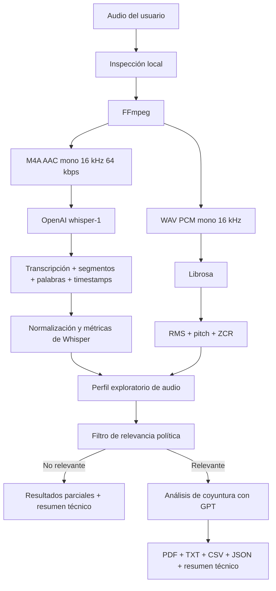

# Optimización del Análisis de Coyuntura Política con IA

MVP de herramienta politológica desarollada en Streamlit para convertir un audio de un discurso  político en una transcripción auditable, un perfil exploratorio de audio, un filtro de relevancia política y un insumo estructurado para el análisis de coyuntura política.

> [!IMPORTANT]
> **Estado actual del proyecto:** este repositorio contiene una **Propuesta de trabajo de grado / bajo la idea de prueba de concepto PoC**, pensada principalmente para **discursos políticos de un solo hablante**. No realiza diarización, no separa automáticamente varias voces, no procesa lotes de audios y no sustituye el juicio profesional del politólogo. Su propósito es validar si una herramienta de IA puede integrarse de forma útil, trazable y metodológicamente prudente a la caja de herramientas cotidiana de la Ciencia Política.

El proyecto sigue el siugiente flujo completo:

```text
Audio
  -> optimización local para transcripción
  -> transcripción temporal con OpenAI
  -> perfil exploratorio de audio
  -> filtro de relevancia política
  -> análisis estructurado de coyuntura
  -> resultados, observabilidad y exportaciones
```

---

## 1. Inicio rápido

### 1.1. Requisitos

Antes de ejecutar la aplicación necesitas:

- **Python 3.10 o superior**.
- **FFmpeg** instalado y disponible en el `PATH`.
- Una **API key de OpenAI** con acceso a los modelos configurados.
- Facturación o saldo disponible en la plataforma de API de OpenAI.
- Conexión a internet durante las llamadas de transcripción y análisis.

> [!NOTE]
> La facturación de la API de OpenAI es independiente de las suscripciones de ChatGPT. Tener ChatGPT Plus, Pro, Business u otro plan no implica que el uso de la API esté incluido.

### 1.2. Clonar el repositorio

```bash
git clone https://github.com/xxxxxxx
cd xxxxx
```

### 1.3. Crear y activar un entorno virtual

#### macOS o Linux

```bash
python3 -m venv .venv
source .venv/bin/activate
```

#### Windows PowerShell

```powershell
python -m venv .venv
.venv\Scripts\Activate.ps1
```

### 1.4. Instalar dependencias de Python

```bash
pip install --upgrade pip
pip install -r requirements.txt
```

Las dependencias principales son:

- Streamlit
- OpenAI SDK
- Pydub
- Librosa
- NumPy
- Pandas
- Plotly
- FPDF

### 1.5. Instalar FFmpeg

FFmpeg se utiliza para leer los formatos de audio admitidos y producir dos archivos temporales: un M4A/AAC optimizado para OpenAI y un WAV PCM para el análisis local con Librosa.

#### macOS con Homebrew

```bash
brew install ffmpeg
```

#### Ubuntu o Debian

```bash
sudo apt update
sudo apt install ffmpeg
```

#### Windows con Winget

```powershell
winget install Gyan.FFmpeg
```

Comprueba la instalación:

```bash
ffmpeg -version
```

---

## 2. Configurar la API key de OpenAI

La aplicación no incluye una clave de API. Cada persona que clone el repositorio debe utilizar su propia credencial.

### 2.1. Crear una API key

1. Ingresa a la plataforma de OpenAI.
2. Crea o selecciona un proyecto.
3. Genera una API key para ese proyecto.
4. Verifica que la cuenta de API tenga facturación o saldo habilitado.
5. Nunca publiques la clave en GitHub, capturas de pantalla, notebooks o archivos compartidos.

Documentación oficial:

- [OpenAI API quickstart](https://platform.openai.com/docs/quickstart)
- [Buenas prácticas para proteger API keys](https://platform.openai.com/docs/guides/production-best-practices)
- [Facturación de ChatGPT y API](https://help.openai.com/en/articles/9039756-managing-billing-settings-on-chatgpt-web-and-platform)

### 2.2. Crear el archivo local de secretos

El repositorio incluye una plantilla pública:

```text
.streamlit/secrets.toml.example
```

Cópiala como archivo local privado:

```bash
cp .streamlit/secrets.toml.example .streamlit/secrets.toml
```

En Windows:

```powershell
Copy-Item .streamlit\secrets.toml.example .streamlit\secrets.toml
```

Abre `.streamlit/secrets.toml` y reemplaza el valor de ejemplo:

```toml
OPENAI_API_KEY = "sk-proj-replace-with-your-key"
```

por tu clave real:

```toml
OPENAI_API_KEY = "sk-proj-..."
```

Configuración mínima recomendada:

```toml
OPENAI_API_KEY = "sk-proj-..."

OPENAI_TRANSCRIPTION_MODEL = "whisper-1"
OPENAI_ANALYSIS_MODEL = "gpt-5.6-luna"
OPENAI_API_TIMEOUT_S = 180
```

El archivo real `.streamlit/secrets.toml` está ignorado por Git. La plantilla `.streamlit/secrets.toml.example` sí debe permanecer versionada.

Más detalles: [`.streamlit/README_SECRETS.md`](.streamlit/README_SECRETS.md).

### 2.3. Ejecutar la aplicación

```bash
streamlit run app.py
```

Streamlit abrirá la interfaz en el navegador. Por defecto suele utilizar:

```text
http://localhost:8501
```

Si modificas `secrets.toml` mientras la aplicación está abierta, detén el servidor y vuelve a iniciarlo.

---

## 3. Cómo usar la aplicación

### Paso 1. Cargar un audio

Formatos admitidos por la interfaz:

- MP3
- WAV
- M4A
- FLAC
- OGG

La aplicación inspecciona el archivo localmente antes de realizar llamadas facturables y muestra:

- tamaño original;
- duración;
- tamaño estimado del archivo optimizado;
- límite de carga configurado;
- duración máxima teórica aproximada con el bitrate actual.

### Paso 2. Escribir el contexto inicial

El contexto es obligatorio. Debe ayudar a identificar:

- fecha o periodo;
- evento o coyuntura;
- persona que habla;
- país o territorio;
- institución o escenario;
- actores relevantes;
- antecedentes necesarios para interpretar el discurso.

Ejemplo:

```text
Discurso presidencial pronunciado durante la instalación del Congreso.
País: Colombia. Tema central: reformas sociales, relación con la oposición
y agenda legislativa del gobierno.
```

Este contexto cumple dos funciones:

1. sirve como apoyo léxico para la transcripción;
2. se incorpora como marco situacional declarado en el filtro y el análisis.

No debe utilizarse para introducir conclusiones que el audio no contiene.

### Paso 3. Ejecutar el pipeline

Presiona **Ejecutar pipeline**. El flujo realiza las siguientes etapas:

1. Optimización del audio.
2. Transcripción con timestamps.
3. Extracción de métricas de audio.
4. Filtro de relevancia política.
5. Análisis estratégico, solo si el audio supera el filtro.
6. Generación de exportaciones y resumen técnico.

### Paso 4. Interpretar el filtro

El filtro asigna una densidad política entre 0 y 100.

```text
0–25   Sin relevancia política suficiente
26–50  Densidad baja e insuficiente
51–75  Densidad media y analizable
76–100 Densidad alta y claramente analizable
```

Si el resultado es menor a 51 o `relevant = false`, el pipeline se detiene de forma controlada y no ejecuta la segunda llamada de análisis político. La transcripción, el perfil de audio y el resumen técnico continúan disponibles.

### Paso 5. Revisar resultados

La interfaz se organiza en cinco pestañas:

- **Pipeline:** carga, contexto, chequeos previos y ejecución.
- **Resultados:** filtro, análisis de coyuntura, actores, disputa de sentidos y trazabilidad.
- **Resumen técnico:** tamaños, modelos, tokens, tiempos, request IDs y costos estimados.
- **Exportación:** descarga de archivos auditables.
- **Proyecto:** espacio opcional para documentos teóricos o metodológicos del proyecto.

---

## 4. Qué exporta el MVP

La aplicación puede generar:

| Formato | Contenido |
|---|---|
| TXT | Transcripción completa |
| CSV | Segmentos, timestamps, métricas y alertas técnicas |
| JSON | Resultado integral: metadatos, perfil de audio, relevancia, análisis y resumen técnico |
| PDF | Informe legible de análisis de coyuntura, cuando el audio supera el filtro |
| TXT técnico | Modelos, tamaños, tokens, tiempos, costos estimados y estado de ejecución |

El JSON es la salida más completa y adecuada para auditoría, reproducción y futuras integraciones.

---

## 5. Alcance actual

### Lo que sí hace

- Procesa un audio por ejecución.
- Está optimizado para discursos con un solo hablante principal.
- Convierte el audio a un formato liviano antes de enviarlo a OpenAI.
- Conserva un WAV local separado para el análisis acústico.
- Obtiene transcripción, segmentos y timestamps con `whisper-1`.
- Calcula un perfil exploratorio de pausas, ritmo, energía, pitch y calidad técnica.
- Filtra materiales sin suficiente densidad política.
- Estructura categorías relevantes para el análisis de coyuntura.
- Registra tamaños, tokens, costos y tiempos de cada etapa.
- Permite cambiar el perfil politológico sin editar el código principal.

### Lo que todavía no hace

- No separa ni identifica múltiples hablantes.
- No realiza diarización.
- No procesa entrevistas con turnos de habla de forma diferenciada.
- No procesa varios audios en lote.
- No compara automáticamente un corpus de discursos.
- No persiste proyectos o resultados en una base de datos.
- No incluye autenticación ni gestión de usuarios.
- No dispone de colas de procesamiento o trabajos en segundo plano.
- No permite elegir entre distintos proveedores de IA.
- No incorpora todavía modelos locales.
- No reemplaza la lectura, interpretación ni validación humana.

---

## 6. Cómo se construyó el MVP

### 6.1. Decisión arquitectónica

El proyecto se mantiene deliberadamente como una aplicación monolítica en `app.py`.

Esta decisión favorece:

- iteración rápida;
- depuración directa;
- despliegue sencillo en Streamlit;
- validación temprana de la propuesta de valor;
- cambios metodológicos sin una infraestructura excesiva.

El monolito ya separa responsabilidades mediante funciones y clases, aunque todavía no mediante módulos independientes. La modularización puede incorporarse cuando la aplicación requiera múltiples desarrolladores, procesamiento concurrente, persistencia o varios proveedores de IA.

### 6.2. Arquitectura funcional



---

## 7. Preprocesamiento del audio

El sistema genera dos artefactos temporales diferentes.

### Archivo enviado a OpenAI

```text
Contenedor: M4A
Codec: AAC
Bitrate: 64 kbps
Sample rate: 16 kHz
Canales: mono
```

Este archivo reduce de forma importante el tamaño de la carga sin enviar un WAV PCM sin compresión.

### Archivo utilizado localmente

```text
Formato: WAV
Codec: PCM s16le
Sample rate: 16 kHz
Canales: mono
Profundidad: 16 bits
```

El WAV no se envía a OpenAI. Se conserva temporalmente para que Librosa trabaje sobre una señal PCM estable.

### Límite de tamaño

La aplicación utiliza un límite configurable de 25 MB para el archivo enviado a la API. Con el bitrate predeterminado de 64 kbps, la interfaz calcula una duración teórica aproximada cercana a 50 minutos, pero el tamaño real puede variar según el contenedor y la codificación.

Antes de llamar a OpenAI se verifica el tamaño real del M4A generado. Si supera el límite, el proceso se detiene sin realizar la llamada de transcripción.

Los audios más extensos requerirán un futuro sistema de fragmentación y recomposición temporal.

---

## 8. Transcripción

El modelo predeterminado es:

```toml
OPENAI_TRANSCRIPTION_MODEL = "whisper-1"
```

La elección responde a que el MVP necesita:

- `verbose_json`;
- timestamps por segmento;
- timestamps por palabra;
- información temporal para pausas y ritmo;
- metadatos útiles para el perfil técnico.

La transcripción recibe el contexto inicial como apoyo léxico. La aplicación conserva:

- texto completo;
- segmentos;
- palabras temporizadas;
- duración de cada segmento;
- `avg_logprob`;
- `compression_ratio`;
- `no_speech_prob`;
- temperatura reportada por Whisper, cuando está disponible.

Documentación oficial: [Speech to text — OpenAI API](https://platform.openai.com/docs/guides/speech-to-text).

---

## 9. Perfil exploratorio de audio

El MVP combina metadatos de Whisper con descriptores calculados localmente mediante Librosa.

### Variables derivadas de la transcripción

- inicio y final de cada segmento;
- duración;
- número de palabras;
- velocidad aproximada en palabras por minuto;
- pausa antes del segmento;
- palabras de duración atípica;
- palabras de baja probabilidad, cuando el modelo las ofrece;
- alertas de confianza, compresión o silencio.

### Variables acústicas locales

- energía RMS;
- pitch mediano;
- variabilidad del pitch;
- zero crossing rate;
- proporción de tramos con voz, cuando puede estimarse.

### Índice exploratorio de intensidad

La aplicación construye un índice relativo dentro de cada audio y selecciona momentos para revisión reforzada.

> [!WARNING]
> Este índice no es una escala psicológica, no detecta emociones y no permite comparar mecánicamente a distintos oradores. Es una heurística para orientar la lectura humana hacia segmentos potencialmente relevantes.

---

## 10. Filtro de relevancia política

Antes de ejecutar un análisis extenso, el sistema pregunta si la transcripción contiene suficiente densidad política.

El perfil actual rastrea, entre otros elementos:

1. acontecimientos con sentido político;
2. escenarios de lucha política;
3. actores identificables;
4. relaciones de fuerza;
5. disputa de poder;
6. disputa de sentidos;
7. construcción de una frontera nosotros/ellos.

Esta etapa reduce costos y evita forzar categorías politológicas sobre audios protocolarios, personales o carentes de conflicto sustantivo.

---

## 11. Análisis de coyuntura

Cuando el audio supera el filtro, el modelo analítico produce una salida JSON normalizada.

El perfil incluido operacionaliza las siguientes dimensiones:

### Tiempo

- larga duración;
- mediana duración;
- corta duración.

### Estructura y coyuntura

- estructura económica;
- estructura política;
- estructura social.

### Acontecimientos

- acontecimiento desencadenante;
- acontecimientos derivados;
- tendencias de fondo.

### Actores

- individuales;
- agregados;
- colectivos;
- institucionales.

Para cada actor puede identificar:

- postura frente al cambio;
- intereses;
- principios;
- recursos;
- relaciones de fuerza;
- cita clave;
- recomendación estratégica en borrador.

### Relaciones de fuerza

- enfrentamiento;
- cooperación;
- coexistencia;
- subordinación.

### Disputa de sentidos

- resignificación de conceptos;
- construcción del nosotros;
- construcción del ellos;
- frontera amigo/enemigo.

### Escenarios

- públicos institucionales;
- públicos sociales;
- privados;
- internacionales.

El resultado no pretende ser un análisis político terminado. Es un insumo ordenado, trazable y revisable para que el profesional lo valide, lo contraste con otras fuentes y desarrolle su propia interpretación.

---

## 12. Perfil teórico y prompts editables

El corazón politológico no está incrustado por completo en el código. Se encuentra en archivos Markdown dentro de:

```text
src/system_prompts/
```

Cada archivo puede convertirse en un perfil seleccionable desde la interfaz.

Estructura mínima:

```markdown
---
id: identificador_unico
name: Nombre visible
description: Descripción corta
default: false
---

## RELEVANCE_PROMPT

Prompt del filtro de relevancia.

## ANALYSIS_PROMPT

Prompt del análisis estratégico.
```

Para crear un nuevo enfoque:

1. duplica el perfil existente;
2. cambia `id`, `name` y `description`;
3. adapta el marco teórico, categorías y reglas;
4. conserva los encabezados `RELEVANCE_PROMPT` y `ANALYSIS_PROMPT`;
5. ajusta el código si modificas la estructura JSON esperada.

Consulta [`src/system_prompts/README.md`](src/system_prompts/README.md).

### Perfil actual

El perfil `01_dsrm_colombia_general.md` está formulado como un marco general aplicable a distintos contextos políticos. Integra categorías atribuidas en el propio archivo a De Souza, Nieto, Zamitiz, Errejón, Fazio, Licha, García y Schmitt.

> [!NOTE]
> El perfil todavía conserva referencias bibliográficas pendientes de completar para De Souza y Nieto, marcadas como `XXXX`. Edisón...  completar y revisar esas referencias.

---

## 13. Observabilidad y costos

El MVP registra información técnica por ejecución.

### Audio

- tamaño del archivo original;
- tamaño del M4A enviado;
- tamaño del WAV local;
- porcentaje de reducción;
- duración;
- bitrate, codec, sample rate y canales.

### OpenAI

- modelo solicitado;
- modelo devuelto;
- request ID, cuando está disponible;
- caracteres de entrada y salida;
- tokens de entrada;
- tokens cacheados;
- escrituras de caché;
- tokens de salida;
- tokens de razonamiento reportados;
- tokens totales;
- tiempo de cada llamada.

### Costos estimados

Se calculan por separado:

- transcripción;
- filtro de relevancia;
- análisis político;
- total de la ejecución.

Las tarifas de referencia están definidas en `secrets.toml.example` y pueden actualizarse sin modificar el código.

> [!CAUTION]
> Los valores mostrados son estimaciones. La fuente definitiva es la facturación y el panel de uso de OpenAI.

---

## 14. Configuración disponible

Las variables se leen primero desde `st.secrets` y, como alternativa, desde variables de entorno.

| Variable | Función |
|---|---|
| `OPENAI_API_KEY` | Credencial de OpenAI |
| `OPENAI_TRANSCRIPTION_MODEL` | Modelo de transcripción |
| `OPENAI_ANALYSIS_MODEL` | Modelo para relevancia y análisis |
| `OPENAI_API_TIMEOUT_S` | Timeout de llamadas |
| `OPENAI_AUDIO_FILE_LIMIT_MB` | Límite del archivo enviado |
| `OPENAI_AUDIO_BITRATE_KBPS` | Bitrate AAC del M4A |
| `OPENAI_AUDIO_ESTIMATE_OVERHEAD_FACTOR` | Margen conservador de estimación |
| `PAUSE_DRAMATIC_THRESHOLD_S` | Umbral de pausa prolongada |
| `ELONGATED_WORD_THRESHOLD_S` | Duración atípica de palabra |
| `LOW_CONFIDENCE_LOGPROB_THRESHOLD` | Alerta de confianza baja |
| `HIGH_COMPRESSION_RATIO_THRESHOLD` | Alerta por ratio de compresión |
| `HIGH_NO_SPEECH_PROB_THRESHOLD` | Alerta por silencio o ruido |
| `PRICING_REFERENCE_DATE` | Fecha de tarifas configuradas |
| `WHISPER_PRICE_PER_MINUTE_USD` | Precio estimado por minuto |
| `GPT_SHORT_*` | Tarifas de contexto corto |
| `GPT_LONG_*` | Tarifas de contexto largo |
| `GPT_LONG_CONTEXT_THRESHOLD_TOKENS` | Umbral de cambio de tarifa |

---

## 15. Estructura del repositorio

```text
ejm_art_ed/
├── .streamlit/
│   ├── README_SECRETS.md
│   └── secrets.toml.example
├── src/
│   └── system_prompts/
│       ├── 01_dsrm_colombia_general.md
│       └── README.md
├── .gitignore
├── LICENSE
├── README.md
├── app.py
├── packages.txt
└── requirements.txt
```

### Archivos principales

| Archivo | Función |
|---|---|
| `app.py` | Aplicación monolítica completa |
| `requirements.txt` | Dependencias de Python |
| `packages.txt` | Dependencias del sistema para Streamlit Cloud |
| `.streamlit/secrets.toml.example` | Plantilla pública de configuración |
| `src/system_prompts/*.md` | Perfiles politológicos y contratos JSON |
| `.gitignore` | Protección de secretos, entornos y archivos locales |
| `LICENSE` | Licencia MIT |

La aplicación también está preparada para leer documentos opcionales desde:

```text
src/project_docs/
```

Si esa carpeta no existe, el chequeo la reporta como una condición no crítica. Se espera que se utlice para mostrar documentos teóricos, manuales metodológicos o notas de diseño dentro de la pestaña **Proyecto**.

---

## 16. Despliegue en Streamlit Community Cloud

El repositorio ya contiene:

- `requirements.txt` con dependencias de Python;
- `packages.txt` con FFmpeg;
- plantilla pública de secretos;
- lectura de configuración mediante `st.secrets`.

Flujo de despliegue:

1. Crea una aplicación en Streamlit Community Cloud.
2. Selecciona este repositorio.
3. Usa `app.py` como archivo principal.
4. Abre la configuración avanzada o la sección **Secrets**.
5. Copia allí el contenido de tu `.streamlit/secrets.toml` local.
6. Guarda y despliega.

No subas el archivo real de secretos al repositorio.

Documentación oficial:

- [Desplegar en Streamlit Community Cloud](https://docs.streamlit.io/deploy/streamlit-community-cloud/deploy-your-app)
- [Gestionar secretos en Community Cloud](https://docs.streamlit.io/deploy/streamlit-community-cloud/deploy-your-app/secrets-management)

---

## 17. Privacidad y uso responsable

El audio optimizado, la transcripción y los prompts se envían a servicios externos de OpenAI.

Antes de procesar entrevistas, reuniones o grabaciones no públicas, considera:

- consentimiento de las personas participantes;
- base jurídica para el tratamiento de datos;
- anonimización o seudonimización;
- información sensible incluida en el audio;
- políticas institucionales de seguridad;
- condiciones de almacenamiento y tratamiento del proveedor;
- restricciones para investigaciones con poblaciones vulnerables.

No utilices el MVP para vigilancia, perfilamiento automático de personas o decisiones que produzcan efectos adversos sin revisión humana.

---

## 18. Limitaciones metodológicas

1. **No es un detector de emociones.** Las métricas acústicas son pistas exploratorias.
2. **El índice de intensidad es intraaudio.** No debe compararse directamente entre personas o grabaciones.
3. **La transcripción puede contener errores.** Nombres propios, siglas y audio ruidoso requieren revisión.
4. **La evidencia del LLM debe contrastarse.** Una estructura JSON correcta no garantiza una interpretación correcta.
5. **El filtro de relevancia no está calibrado estadísticamente.** Su umbral es una regla metodológica del MVP.
6. **Las recomendaciones son borradores.** No constituyen asesoría política automatizada.
7. **El corpus actual no tiene validación publicada.** Todavía se requiere contrastar resultados con codificación humana.
8. **El perfil teórico es editable.** Cambiar el prompt puede modificar sustancialmente los resultados.

---

## 19. Hoja de ruta: de prueba de concepto hacia una herramienta politológica robusta

El valor del MVP no está solo en su funcionamiento actual, sino en demostrar que es posible construir herramientas especializadas para el trabajo cotidiano de politólogos, investigadores, docentes, consultores y equipos de análisis.

### Fase 1. Robustecer el MVP

- pruebas unitarias y de integración;
- reintentos ante fallos de API;
- pipeline reanudable por etapas;
- validación formal con JSON Schema o modelos tipados;
- verificación automática de citas contra la transcripción;
- mejor registro de errores y request IDs;
- actualización automatizada de precios y modelos;
- documentación bibliográfica completa.

### Fase 2. Procesar audios largos

- fragmentación automática por duración o tamaño;
- cortes cercanos a silencios;
- solapamiento controlado entre fragmentos;
- eliminación de texto duplicado;
- corrección de offsets temporales;
- reintento exclusivo del fragmento fallido;
- recomposición final de segmentos y palabras.

### Fase 3. Entrevistas y múltiples voces

La evolución natural es pasar de discursos unipersonales a entrevistas, debates, grupos focales y reuniones.

Esto requeriría:

- diarización;
- identificación o etiquetado de hablantes;
- turnos de conversación;
- métricas por participante;
- interrupciones y solapamientos;
- preguntas y respuestas;
- comparación de marcos discursivos;
- relaciones de fuerza expresadas entre hablantes;
- trazabilidad de cada afirmación hacia un participante concreto.

Podría integrarse una solución vía API o un pipeline local con modelos de diarización.

### Fase 4. Analizar varios audios y construir corpus

- carga múltiple;
- procesamiento en lote;
- metadatos por audio;
- panel de avance;
- comparación temporal;
- análisis por actor, partido, institución o periodo;
- búsqueda transversal de citas;
- evolución de conceptos y marcos;
- identificación de recurrencias discursivas;
- exportación de matrices para análisis cuantitativo o cualitativo;
- construcción de corpus reproducibles.

### Fase 5. Múltiples proveedores de IA

Una versión más madura debería desacoplar el dominio politológico del proveedor tecnológico.

Posibles rutas:

- transcripción por API o modelos locales;
- diarización por API o modelos locales;
- LLM remoto o ejecutado en infraestructura propia;
- selección del proveedor según costo, privacidad o calidad;
- fallback automático;
- comparación entre modelos;
- ejecución completamente local para materiales sensibles.

Una arquitectura por adaptadores permitiría utilizar OpenAI, otros servicios compatibles o modelos abiertos ejecutados con herramientas como Ollama, MLX o vLLM, sin modificar el núcleo metodológico.

### Fase 6. Producto colaborativo

- autenticación;
- proyectos y usuarios;
- base de datos;
- almacenamiento de audios y resultados;
- historial de versiones;
- prompts versionados;
- colas de trabajo;
- procesamiento asíncrono;
- roles de analista, revisor y administrador;
- anotaciones humanas;
- aprobación y corrección de resultados;
- paneles comparativos;
- API propia para integraciones.

### Fase 7. Validación disciplinar

Para convertirse en un instrumento politológico y no solo en una demostración tecnológica, será necesario:

- construir un corpus anotado por expertos;
- definir protocolos de codificación;
- medir acuerdo entre codificadores;
- comparar modelos y prompts;
- estimar precisión, exhaustividad y consistencia;
- documentar sesgos y casos de fallo;
- establecer categorías que requieren revisión obligatoria;
- publicar metodología, versiones y límites de validez.

---

## 20. Visión del proyecto

Este MVP plantea una hipótesis sencilla pero relevante: la IA puede ser más útil para la Ciencia Política cuando deja de operar como un asistente genérico y se integra a flujos especializados, categorías disciplinares, evidencia trazable y mecanismos de revisión humana.

La aplicación no busca automatizar al politólogo. Busca reducir tareas repetitivas, ordenar información, revelar pasajes que merecen atención y producir insumos que hagan más eficiente el trabajo analítico.

Su potencial de evolución incluye:

- discursos políticos;
- entrevistas semiestructuradas;
- debates legislativos;
- ruedas de prensa;
- grupos focales;
- reuniones institucionales;
- comparecencias públicas;
- series históricas de intervenciones;
- corpus de campañas electorales;
- análisis comparado entre actores y periodos.

La meta de largo plazo es contribuir a una caja de herramientas computacional para politólogos que combine rigor conceptual, métodos reproducibles, IA, procesamiento de lenguaje, análisis de audio y supervisión experta.

---

## 21. Solución de problemas

### `Falta OPENAI_API_KEY`

Comprueba que exista:

```text
.streamlit/secrets.toml
```

Y que contenga:

```toml
OPENAI_API_KEY = "sk-proj-..."
```

Reinicia Streamlit después de editarlo.

### `No se encontró FFmpeg`

Instálalo y comprueba:

```bash
ffmpeg -version
```

### La API rechaza el archivo por tamaño

El M4A real superó el límite. Utiliza un audio más corto o espera la implementación de fragmentación automática.

### El modelo no está disponible

Verifica:

- nombre del modelo en `secrets.toml`;
- permisos del proyecto de OpenAI;
- facturación;
- límites de uso;
- versión del SDK.

### No aparecen perfiles de prompt

Comprueba que exista al menos un `.md` válido dentro de:

```text
src/system_prompts/
```

Y que contenga las secciones:

```markdown
## RELEVANCE_PROMPT
## ANALYSIS_PROMPT
```

### El audio no supera el filtro

No necesariamente es un error. El MVP está diseñado para detener el análisis cuando el material no contiene suficiente conflicto, actores, relaciones de fuerza o disputa de sentidos.

Revisa:

- transcripción;
- contexto inicial;
- respuesta cruda del filtro;
- criterios faltantes;
- calidad del audio.

---

## 22. Contribuciones

Las contribuciones son bienvenidas, especialmente en:

- validación politológica;
- nuevos perfiles teóricos;
- diarización;
- procesamiento por lotes;
- modelos locales;
- pruebas automatizadas;
- accesibilidad;
- privacidad;
- documentación;
- optimización de audio;
- visualizaciones comparativas.

Antes de proponer cambios grandes, conviene abrir un issue que describa:

1. problema;
2. caso de uso politológico;
3. propuesta técnica;
4. impacto metodológico;
5. criterios de validación.

---

## 23. Licencia

Este proyecto se distribuye bajo licencia MIT.

Consulta [LICENSE](LICENSE).

Copyright © 2026 Edinso....

---

## 24. Referencias técnicas útiles

- [OpenAI API documentation](https://platform.openai.com/docs)
- [OpenAI Speech to Text](https://platform.openai.com/docs/guides/speech-to-text)
- [OpenAI API billing](https://help.openai.com/en/collections/3675945-understanding-openai-api-billing-and-usage)
- [Streamlit documentation](https://docs.streamlit.io/)
- [Streamlit secrets management](https://docs.streamlit.io/develop/concepts/connections/secrets-management)
- [Streamlit Community Cloud](https://docs.streamlit.io/deploy/streamlit-community-cloud)
- [FFmpeg documentation](https://ffmpeg.org/documentation.html)
- [Librosa documentation](https://librosa.org/doc/latest/index.html)

---

## Autor

**Edison Henao Hernández**  
PPeriodista..., Politólogo....